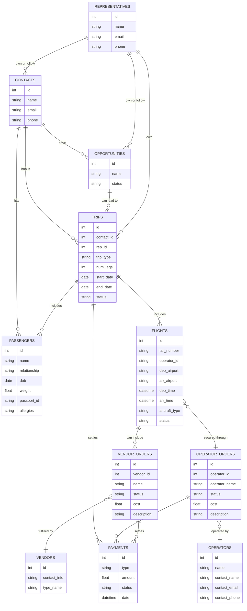

# Design Document

# 1. Current Status (Completed)

---

The following functionality is already built and live:

- **Lead acquisition** from marketing channels into GHL
- **Opportunity tracking** in GHL pipelines
- **Quote generation process**
- **Contracting & payment handling**:
    - Invoice generation
    - CC authorization
    - Wire transfer support
    - 

This design doc focuses on what happens **after payment** and the optimization of upstream workflows.

---

## 2. Areas Needing Optimization

Before extending into logistics and operations, several existing workflows should be optimized:

- **Lead Qualification Workflows**
    - Automate trip vs. jet card qualification
    - Standardize qualification criteria and store in Airtable

---

## 3. New Concepts to Initialize

To extend the workflow beyond payment, we need new **data objects** linked to GHL Contacts.

### 3.1 Passenger Profiles

- Independent records from Contact (since the contact isn’t always a flyer)
- Includes:
    - Name
    - Relationship to booking contact
    - DOB, weight
    - ID/passport (file upload)
    - Allergies, preferences
- **One contact may have multiple passenger profiles**

### 3.2 Flights

- Represents a **single aircraft booking** with operator
- Includes:
    - Operator details
    - Aircraft type, tail #
    - Departure/arrival airport
    - Departure date/time
    - Duration
    - Status (requested, confirmed, completed)
- **A Trip can include one or multiple Flights**

### 3.3 Trips

- The “master” operational object
- Links together:
    - Contact (primary client)
    - Passenger profiles (one-to-many)
    - Flight(s)
    - Vendor_Orders (catering, transport, other services)
    - Payments (already secured)

### 3.4 Vendors

- Categories: Catering, Transportation, Other
- Standard flow: Quote → Confirm → Pay → Reconcile

---

## 4. System Design

### 4.1 GHL Role

- **Front-end CRM** for lead capture, nurturing, and communications
- Primary place for Sales Reps to manage opportunities
- Stores:
    - Contacts (clients & prospects)
    - Pipelines (sales & operations)
    - Automations (marketing, reminders, notifications)

### 4.2 Airtable Role

- **Operational Database** & Single Source of Truth for trips
- Stores structured data objects:
    - Trips
    - Flights
    - Passengers
    - Vendors
    - Payments
- Used by Operations team for logistics, reconciliation, and reporting

### 4.3 System Flow

[Sign up | Miro | Online Whiteboard for Visual Collaboration](https://miro.com/welcomeonboard/NWYwZGc2bi8yL2lQNE83Z1ZxUzhLM1R3Q0VVallBalY5MzJFVEl2RFN0bERLRTFLaFdBTzJSSzd0ZVVaMUxYTXdsV3JXWDZWdmV3T29lcnNVb2htK2pGMDFVTEpCWEZuVEc1d3B6bFZxUXowaUhiUkJUY2tXL0t6R054Z1FoSVdzVXVvMm53MW9OWFg5bkJoVXZxdFhRPT0hdjE=?share_link_id=258649230893)

---

## 5. Tech Decisions

### 5.1 Official Stack

- Cursor: IDE
    - Reason: decided to stay away from firebase studio to sharpen my skills and have more control via a proper git process. Even though it’s great. I want more control and better learning with Cursor.
- Firebase: Hosting
    - *Reason*: want to stay full google.
- FireStore: Integrated Database
    - Easily Maintainable google solution and in Firebase stack
    - Firebase v.s. Airtable Notes: (moving away from airtable because I will not build any interfaces anyway.)
    
    **Yes, Firestore is the recommendation.**
    
    Key reasons:
    
    - **Custom forms need a proper database** (not Airtable's API)
    - **Stays Google ecosystem** (your requirement)
    - **Real-time + scalable** (no rate limits)
    - **Firebase Admin SDK** for ops team superpowers
    - 
    
    [FireStore v.s. BigQuery](https://www.notion.so/FireStore-v-s-BigQuery-270b60a291ed8023ab0eed4c28bfcc6f?pvs=21)
    
- Google API Storage: File Storage (passports)
    - Google Solution

### 5.2 TBDs and Discussions

Dont want to delete these want to keep my notes on I why I made decisions and what I researched.

1. Determined Passport Storage
    1. Firestore or Google API storage?
        1. Google API is the correct solution. FireStore is meant for structured data.
    2. URL organization determined in 6.5

### 5.3 Vibe Coding Approach

I will keep notes on this and how effective it was in a separate doc but I will create a markdown version of this and then use it cursor I will keep version of these docs. I will then periodically update this with anything relevant from there manually this way I don’t get distracted using MCP etc.

---

# 6. Data:

### 6.1 Relationships

Below needs final review



<aside>
🧻

**Database Design Approach**

For v1.0 we will rely on normalized relationships rather than duplicating data across tables. This avoids ***data drift***

*(where two copies of the same information fall out of sync) and keeps the system easier to maintain. In Airtable, linked records, lookups, and rollups provide the same benefits as foreign keys and joins in a relational database. Given the system’s expected size, Airtable can handle these relationships efficiently without needing denormalization or redundant fields.*

</aside>

### **6.2. Centralized Logs Table**

**Advantages:**

- Easier to manage than dozens of tiny log tables.
- Centralized reporting — you can filter by table, record, user, or action.
- Reduces schema complexity in Airtable.

**Structure (recommended):**

| Field Name | Type | Notes |
| --- | --- | --- |
| `Timestamp` | Created time | When change occurred |
| `User` | Collaborator / text | Who made the change |
| `Action` | Single select | Created / Updated / Deleted |
| `Table Name` | Single select | E.g., Trips, Passengers, Vendors |
| `Record ID` | Single line text | Airtable record ID |
| `Record Name` | Single line text | Primary field from the record |
| `Changed Fields` | Long text / JSON | Optional: list of fields changed |
| `Previous Values` | Long text / JSON | Optional: old values |
| `New Values` | Long text / JSON | Optional: new values |

### 6.3 Opportunities and Trips

there will be relation between them but a 1:1 relationship

### 6.4 Representatives live in Airtable and GHL

mainly airtable so that they can have a log in etc. also in ghl becasue they are users/contacts

### 6.5 Passport Link

```python
Airtable (your main database)
├── Passenger Profiles table
│   ├── passport_url (link to Cloud Storage)
│   └── passport_uploaded_date
│
Google Cloud Storage
├── Bucket: passenger-documents
│   └── Structure: /contacts/{contact_id}/passengers/{passenger_id}/passport.jpg
```

# 7 Interface Design

## 7.1 Interface #1: Internal - Trip Creation

Fields Entered by Broker.

1. Flight info
2. Contact Info
3. any other info

this should then be sent to the client to complete with the initialized Trip

(will likely be automated in the future to add more of a connection between the quote and flight but for now this can should be handled by the broker)

### Data Notes:

This form will 

**create**

Trip

Flight

Advanced (post MVP):

Entering the contact info will allow for linking of an opportunity or this should be done automatically via some validation. 

### Process Notes:

This is the same interface that will be used in order to finalize the creation of the trip and send off to create the trip sheet.

## 7.2 Interface #2: Client - Trip Form

This is the final input the client will have into the system the rest will be handled by the rep.

**IMPORTANT**: This interface is NOT accessible directly. It is only generated as a unique link when a trip is created by the broker. Each trip object will have a "Copy Client Link" button that generates a unique URL like `/client/trip/{tripId}`.

Client will input:

1. Guest info
2. Luggage Info
3. Any requests for Catering etc.

The structure is:

Trip 

Flight 1

Luggage Info

Number of Checked Bags <50lbs

Number of Carry Ons 

Number Misc Bags (describe each)

Passenger Profiles

Number of Guests

Guest 1 Info

Guest 2 Info

Catering and Transport? per flight.

add Details if yes

…

Flight 2

….

Wording

Aircraft Luggage Manifest

**1. Total Number of Small / Traditional Carry-on Bags**

**2. Total Number of Large / Traditional Checked Bags**

**3. Special or Oversized Items**

1. Are you bringing any pets?

**4. Estimated Total Weight of All Luggage**

Safety Declarations

**5. Will you be transporting any firearms?**

**6. Are you carrying any hazardous materials?**

ability to use saved guest profiles

I believe that the repeatable guest info feature is very important and will drive me to build a custom solution

[Saved Guest Profile Implementation](https://www.notion.so/Saved-Guest-Profile-Implementation-270b60a291ed80919bd2d1e421b98140?pvs=21)

What I imagine that the flights will be subimmited as pages of the form and when one is completed. The Guest Profiles are loaded into the airtable as record with the unique ID

Then they can be reused on the next page. Any saved guests will be pulled according to the contact_id. Note the form will only be accessed by the contact id.

## 🔹 1. How This Works Conceptually

1. **Flight 1 page submitted**
1. **Flight 2 page loads**
1. **Flight 2 submission**

---

## 🔹 2. Airtable Requirements

You need these tables/fields:

| --- | --- | --- |

- **Important:** Guest Profiles must include `Contact ID` so you can query all guests for that contact.
- Flight Guests join table ensures you don’t duplicate guests for multiple flights.

---

## 🔹 3. Frontend Implementation

- **Page 1 (Flight 1)**
- **Page 2 (Flight 2)**

---

## 🔹 4. Notes / Limitations

- **Native Airtable forms / Fillout**: cannot do this fully.
- **Custom-coded form** is required to:

---

✅ **Bottom line:**

With a custom-coded form + Airtable API, you can fully implement this:

- Flight 1 submission → create guests
- Flight 2 page → pull guests for this contact, allow selection + editing
- Flight 2 submission → update guests + link them to the new flight

---

If you want, I can **draw a flow diagram** showing exactly how the data moves from multi-page form → Airtable tables → Flight Guest join table, including PATCH vs POST operations.

Do you want me to do that?

### Data Notes:

This form will 

update

Trip

Flight

create/update

Guest Profiles

### Tech

1. I am leaning toward using Airtable still as the central database. with a custom frontend form that will allow for the reuse of guest profiles
2. Will use a mix of Cursor and Firebase Studio. 

### Passport Storage (airtable with links to google api storage)


Post Dev of the two above

## 7.3. Interface 3 - Vendor Service Entry (least important of the three)

Purpose: Create Entries for Vendor Services

simple form. should be able to use airtable

may be a bit complex when looking at how we want to manage payments and link them to the vendor services

## 7.4 Future Interfaces.

## Payment Logging Integrations

What i am doing is creating a secondary operating system to manage finance which may be a bit overkill. There should be the option to link a quickbooks entry or something via optional link.

For now i dont need to worry about the payments objects

## 7.5 Styling and UI/UX Notes

**Font:** 'Plus Jakarta Sans',Helvetica,Arial,Lucida,sans-serif

**Font Color:** Grey ****#6d5e5e 

**Primary Color:** White

Secondary Color: Black

**Accent Color: Red #e02b20**

**Button Style:**

/* Primary Button Style */
.primary-button {
/* Appearance */
background-color: #111111;
color: #FFFFFF;
border-radius: 100px;
box-shadow: 0px 5px 5px 0px rgba(17, 17, 17, 0.15);

/* Typography */
font-family: 'Plus Jakarta Sans', Helvetica, Arial, Lucida, sans-serif;
font-size: 15px;
font-weight: 600;

/* Spacing */
padding: 14px 60px 17px 60px;

/* Interaction */
transition: all 300ms ease 0ms;
cursor: pointer;
text-decoration: none;

## 9 Workflow Design

This is the first thing I want to develop

How the interfaces 1,2 and 3 play together.

**Step 1. Trip Creation (Broker)**
- Broker initiates the trip through admin.flyjetr.com
- Creates trip with flight details, contact info, etc.
- Upon completion, trip object is created with unique ID
- **"Copy Client Link" button** generates unique URL: `/client/trip/{tripId}`
- Webhook sends link to CRM for broker to share with client

**Step 2. Client Completion (Client)**
- Client receives unique link from broker
- Completes multi-page form with guest profiles, luggage, catering
- Progress bar shows completion status (only during form completion)
- Form data is saved to trip object

**Step 3. Trip Finalization (Broker)**
- Broker is notified via webhook when client completes form
- Broker reviews and finalizes trip details
- Trip status updated to "confirmed" or "completed"
- Progress bar shows: Trip Creation → Client Completion → Trip Finalization

**Progress Bar Behavior:**
- Only appears during active form completion
- Shows current step and completion percentage
- Hidden on dashboard and trip management screens

## 10. Design Updates Log

**Note**: For detailed design updates, UI/UX changes, and visual improvements, see the separate [Design Updates v1](design-updates-v1.md).

### v1.1 - 2025-01-27 16:45 - Interface Access Control
**Change**: Interface #2 (Client Trip Form) is no longer directly accessible
**Why**: Security and proper workflow - clients should only access via unique trip links
**Impact**: 
- Removed direct access to client form from dashboard
- Added "Copy Client Link" button to trip objects
- Client form only accessible via `/client/trip/{tripId}` URLs
- Progress bar only shows during active form completion

### v1.2 - 2025-01-27 16:50 - Workflow Clarification
**Change**: Clarified 3-step workflow with proper progress tracking
**Why**: Better understanding of when and how progress bars should appear
**Impact**:
- Progress bar only during form completion, not on dashboard
- Clear separation between broker and client interfaces
- Better webhook integration points

### v1.3 - 2025-01-27 17:30 - Documentation Restructure
**Change**: Created separate design-updates.md for design-specific documentation
**Why**: Better organization of design updates separate from architectural changes
**Impact**:
- Design updates now tracked in dedicated document
- Cleaner separation of concerns in documentation
- More detailed design system documentation

---

## 11. Future Enhancements (not to be developed)

- Operator API integration (real-time aircraft availability)
- Jet card management module
- Automated client trip portal
- Payment Triggered Workflows (QB/Auth.net integration)

---